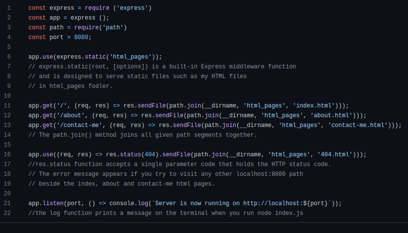

# Basic-Node.js/Express-Page

In my very first Node.js/Express project I created a simple webpage that listens
to port 8080 and serves content from four other very basic html pages.

# How it works:

Use:

```
  node index.js
```

to start the server on localhost:8080.
*localhost:8080/about*  is a valid page.

*localhost:8080/contact-me* is a valid page.

*localhost:8080/about-me* is non-existing and will throw a 404 error.


# Code Sample: 

I made sure I comment out almost every line as this is
uncharted territory for me. It also makes understanding
and remembering everything much easier.


